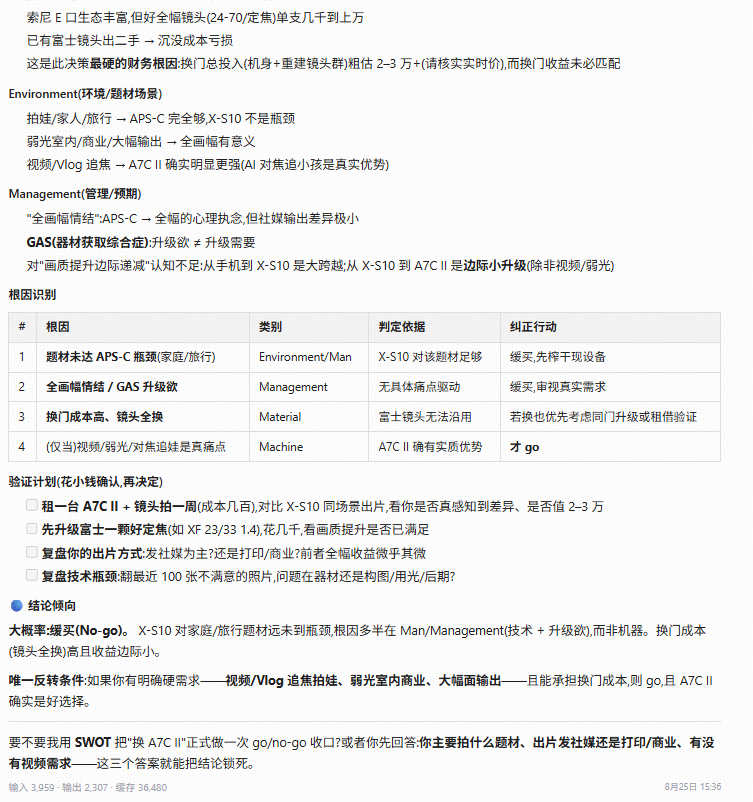
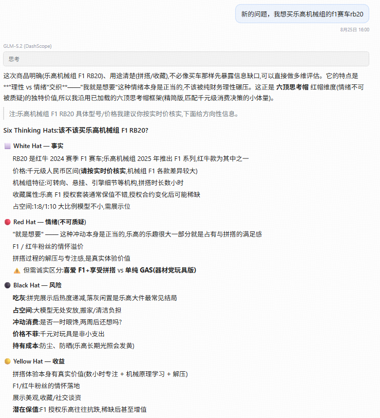
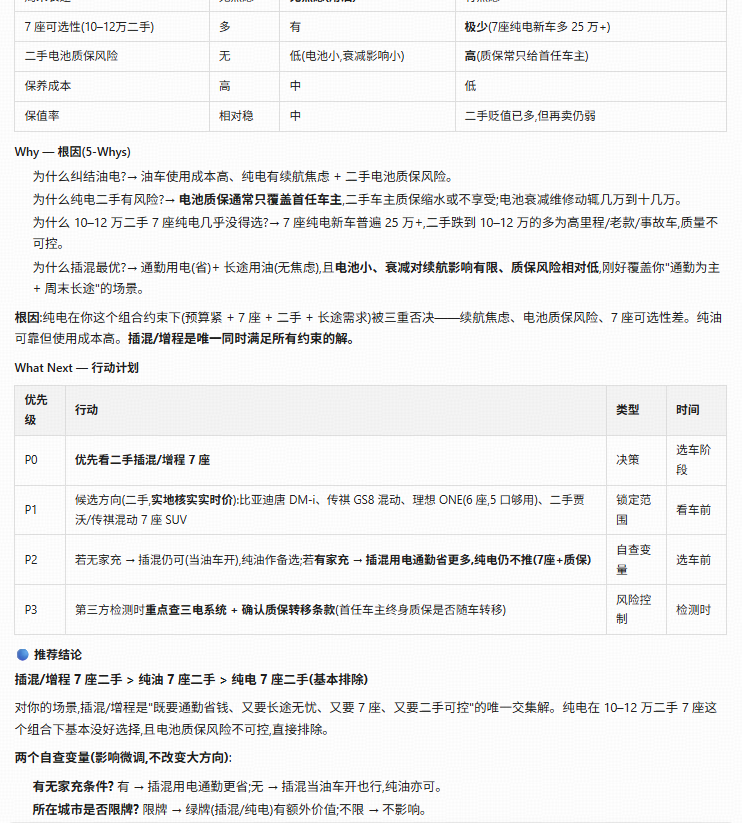

# make-rational-decision

> **科学的思考方式 + 足够的数据支撑 = 理性的决策**

> 10 种经典分析方法的 TypeScript 扩展库 + [pi](https://github.com/earendil-works/pi-coding-agent) skills。

本仓库包含两部分，二者协同工作：

1. **`skills/`** — 10 个 pi [技能](https://github.com/earendil-works/pi-coding-agent)（Markdown `SKILL.md` 文件），教会智能体如何执行每种分析方法，外加 `skills/_shared/` 下一组跨技能复用的共享扩展。
2. **`src/`** — TypeScript 库（`make-rational-decision`），提供类型化的数据结构、Mermaid 图表渲染、PDCA/SMART 追踪、研究协议、多视角输入合成器，以及按顺序串联各技能的工作流引擎。

涵盖的 10 种分析方法：

| # | 技能 | 用途 |
|---|-------|---------|
| 1 | `six-thinking-hats` | 多视角思考（六种思维角色） |
| 2 | `3w-analysis` | What → Why → What next |
| 3 | `swot-analysis` | 内部/外部战略评估 |
| 4 | `5w2h-analysis` | 为何/是何/谁/何时/何地/如何/多少 |
| 5 | `mece-analysis` | 相互独立、完全穷尽的问题树 |
| 6 | `fishbone-analysis` | 鱼骨图（石川图，6M 根因分析） |
| 7 | `pdca-cycle` | 计划-执行-检查-处理 持续改进 |
| 8 | `smart-goals` | 具体/可衡量/可达成/相关/有时限的目标 |
| 9 | `pest-analysis` | 政治/经济/社会/技术 扫描 |
| 10 | `bcg-matrix` | 增长-份额组合矩阵 |

十种方法的简明参考见 [`10-methods.md`](./10-methods.md)。

---

## 示例

三种「该不该买」决策示例，点击标题展开 / 收起：

<details>
<summary>📷 该不该买相机（should buy camera）</summary>



</details>

<details>
<summary>🧱 该不该买乐高（should buy lego）</summary>



</details>

<details>
<summary>🚗 该不该买新车（should buy new car）</summary>



</details>

## 快速开始

环境要求：Node.js ≥ 18（项目目标为 ES2022，ESM 模块）。

```bash
# 安装依赖
npm install

# 编译 TypeScript -> dist/
npm run build

# 清理构建产物
npm run clean
```

`npm run build` 使用 `tsconfig.json` 中的配置运行 `tsc`（`declaration`、`declarationMap`、`sourceMap`、`strict`）。产物为 ESM 格式，输出到 `dist/`。

## 安装指引

本项目的技能运行在 [pi coding agent](https://github.com/earendil-works/pi-coding-agent) 之上。下面依次安装 pi agent、本项目的技能，以及可选的 Web 界面。

### 1. 安装 pi coding agent

```bash
npm install -g --ignore-scripts @earendil-works/pi-coding-agent
```

鉴权（任选其一）：

```bash
# 方式 A：API key
export ANTHROPIC_API_KEY=sk-ant-...
# 方式 B：交互式登录订阅（ChatGPT Plus / Claude Pro / Copilot 等）
pi
/login
```

### 2. 安装 pi-agent-web（Web UI）

[pi-agent-web](https://github.com/MaddieMo1/Pi-Agent-Web)（npm 包 `@maddie1/pi-agent-web`）是一个本地 Web 界面，可在浏览器中浏览历史会话、继续对话、管理模型与工具配置，并通过 SSE 实时展示 Agent 的流式输出与工具调用。

```bash
# 免安装直接运行
npx @maddie1/pi-agent-web@latest

# 或全局安装后用命令行启动
npm install -g @maddie1/pi-agent-web
pi-web            # 等价命令：pi-agent-web

# 自定义端口/主机
pi-web --port 8080 --hostname 127.0.0.1
```

启动后访问 <http://localhost:30141>。它默认读取 `~/.pi/agent/sessions` 下的会话；如需指向其他 agent 数据目录：

```bash
PI_CODING_AGENT_DIR=/path/to/agent-dir pi-web
```

> 国内 npm 镜像可能尚未同步最新版本，可临时指定官方源：
> `npx @maddie1/pi-agent-web@latest --registry https://registry.npmjs.org`

### 3. 将本项目的技能接入 pi

每个技能都是自包含的 `SKILL.md`（含 YAML front matter `name`/`description`），pi 会自动发现并可通过 `/skill:<name>` 调用；技能运行时引用 `skills/_shared/` 下的共享扩展。`dist/` 中的 TypeScript 类型供程序化消费方使用，pi 运行时本身不加载它。两种接入方式择一：

**方式 A：作为 pi 包安装（推荐）**

发布或推送到 git 后，用 `pi install` 安装。pi 会按约定自动发现根目录 `skills/`：

```bash
# 从 git 安装
pi install git:github.com/mingyao743/make-rational-decision

# 项目本地安装（写入项目的 .pi/）
pi install git:github.com/mingyao743/make-rational-decision -l

# 发布到 npm 后
pi install npm:make-rational-decision

# 用 pi config 启用/禁用具体技能
pi config
```

**方式 B：手动放入 skills 路径**

将本仓库的 `skills/` 目录放入 pi 的技能发现路径之一：`~/.pi/agent/skills/`、`~/.agents/skills/`（全局），或项目内 `.pi/skills/`、`.agents/skills/`（从 `cwd` 向上直至 git 仓库根）。

## 许可证

MIT — 见 `package.json`。
