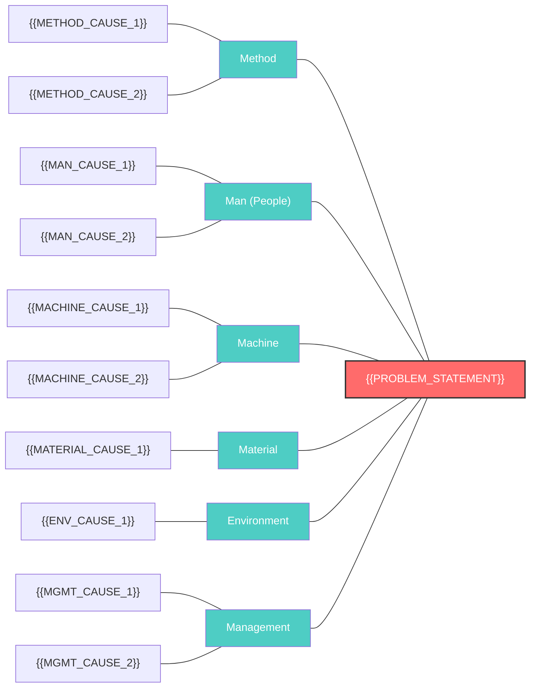
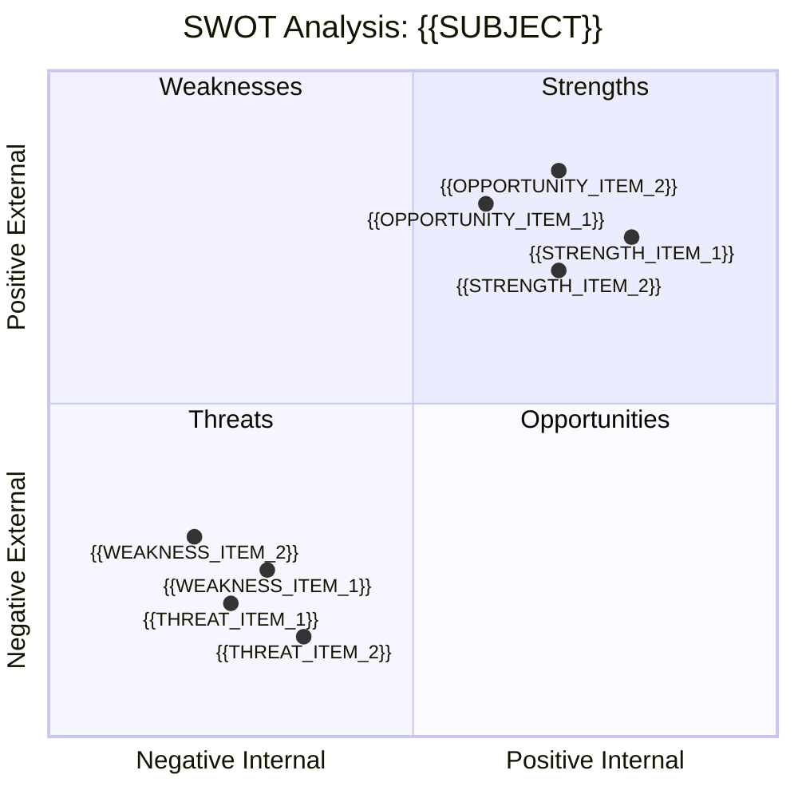
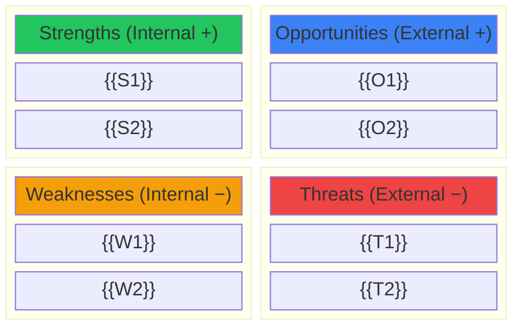
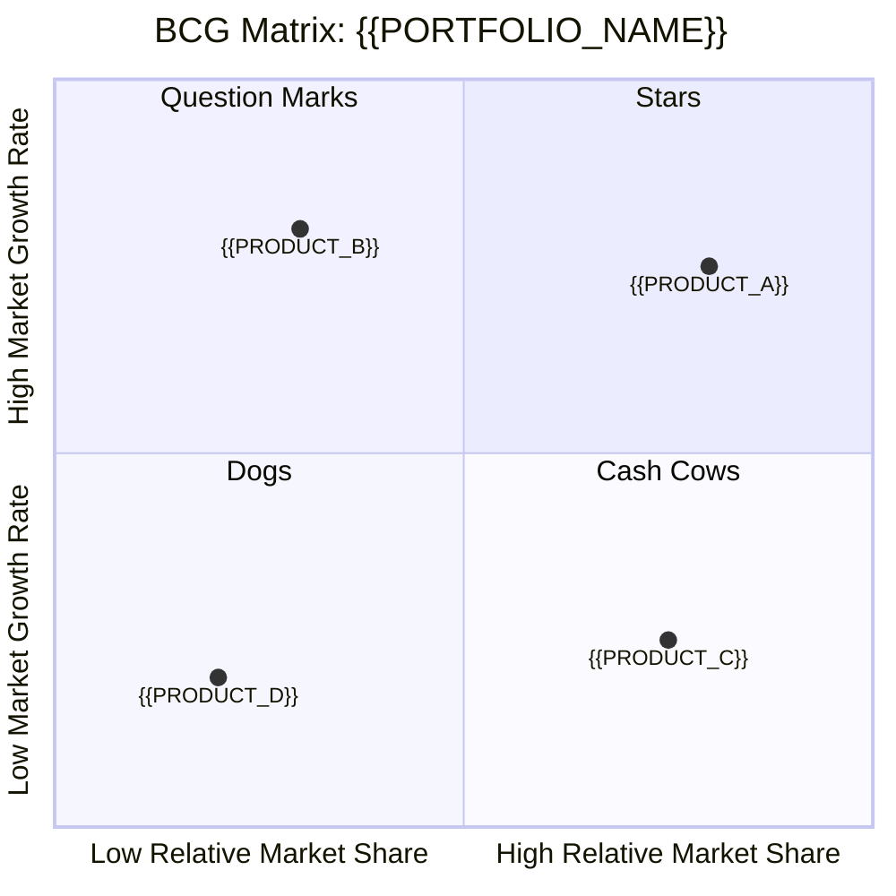
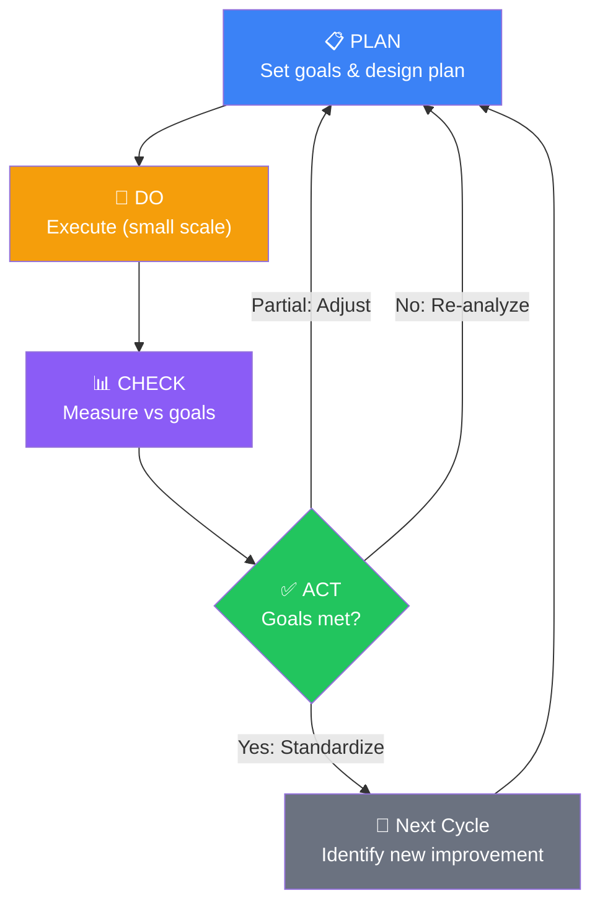
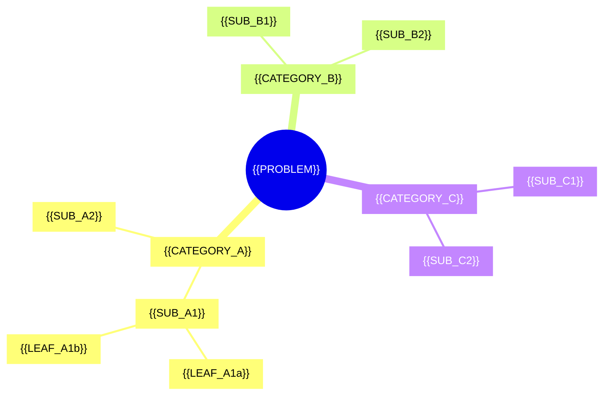
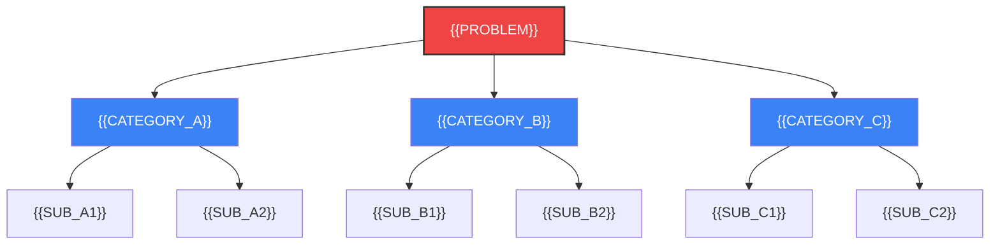
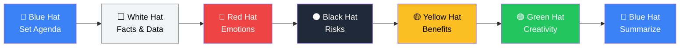
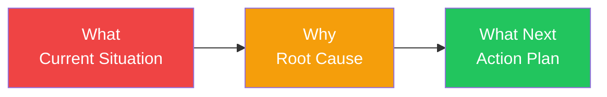
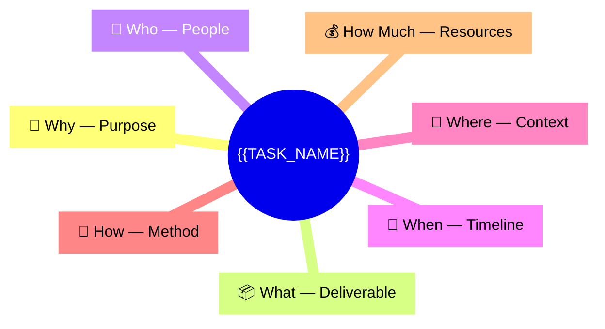

# Diagram Renderer Extension

Shared Mermaid diagram templates for all visual analysis skills. Use these to render professional diagrams instead of ASCII art when the output supports Mermaid rendering.

## Usage

When a skill produces a visual output, replace the ASCII diagram in the skill's output format with the corresponding Mermaid template below. Fill in the placeholders with actual content.

---

## Fishbone Diagram (Ishikawa)

---

## SWOT Matrix

### SWOT Table Alternative (if quadrantChart unsupported)

---

## BCG Matrix

---

## PDCA Cycle

---

## MECE Issue Tree

### MECE Issue Tree (Flowchart variant)

---

## Six Thinking Hats Sequence

---

## 3W Flow

---

## 5W2H Radar

---

## Rendering Notes

- All templates use `{{PLACEHOLDER}}` syntax — replace with actual content before rendering
- If the output environment does not support Mermaid, fall back to the ASCII diagrams in the skill's SKILL.md
- Bubble sizes in quadrant charts can encode revenue/investment by adjusting the position spread
- Colors follow a consistent scheme: green = positive, red = negative, blue = neutral/process, amber = caution
